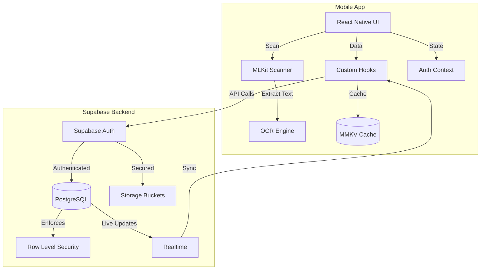

# ShoeBox Receipt Tracker - Implementation Plan

## Product Vision

Receipt and expense tracking app with MLKit document scanning, OCR text extraction, Supabase cloud storage, user authentication, and smart categorization for iOS and Android.

## Technology Stack

**Backend:** Supabase

- PostgreSQL database with Row Level Security (RLS)
- Supabase Auth for authentication
- Supabase Storage for receipt images
- Edge Functions for serverless logic

**Frontend:** React Native (Expo SDK 54)

**New Dependencies to Add:**
- `@supabase/supabase-js` - Supabase client SDK
- `expo-secure-store` - Secure token storage for auth
- `expo-image` - Peer dependency for MLKit
- `expo-location` - GPS location access for geo-tagging receipts
- `@turf/helpers` (^7.2.0) - Geospatial helper utilities for geo-tagging
- `@turf/nearest-point-on-line` (^7.2.0) - Find nearest location on route
- `@turf/turf` (^7.2.0) - Advanced geospatial analysis for receipt locations

**Existing Dependencies (Already in package.json):**
- `@infinitered/react-native-mlkit-document-scanner` - Document scanning
- `react-native-mmkv` - Fast local storage and caching
- `@react-navigation/*` - Navigation
- `react-native-reanimated` - Animations
- `apisauce` - HTTP client (if needed for API wrappers)
- `date-fns` - Date utilities
- `i18next` + `react-i18next` - Internationalization

## Immediate Next Steps (Weeks 1-3)

### Week 1: Foundation & Backend Setup

**Day 1-2: Supabase Project Setup**

1. Create Supabase account at [supabase.com](https://supabase.com)
2. Create new project named "ShoeBox"
3. Save credentials:

   - Project URL (from Settings > API)
   - Anon/Public key (from Settings > API)
   - Service role key (for admin operations)

**Day 2-3: Install Dependencies**

```bash
yarn add @supabase/supabase-js expo-secure-store expo-image expo-location @turf/helpers@^7.2.0 @turf/nearest-point-on-line@^7.2.0 @turf/turf@^7.2.0
```

Note: We're leveraging existing dependencies already in your project:
- State management: React Context + MMKV (no Zustand needed)
- Data fetching: Custom hooks + MMKV cache (no React Query needed)
- Navigation: @react-navigation (already configured)
- Animations: react-native-reanimated (already included)

**Day 3-4: Database Schema**

Create these tables in Supabase SQL Editor:

```sql
-- Users profiles table
create table profiles (
  id uuid references auth.users primary key,
  email text,
  full_name text,
  avatar_url text,
  created_at timestamp with time zone default now(),
  updated_at timestamp with time zone default now()
);

-- Receipts table
create table receipts (
  id uuid primary key default uuid_generate_v4(),
  user_id uuid references auth.users not null,
  merchant_name text,
  amount decimal(10,2),
  currency text default 'USD',
  category text,
  date timestamp with time zone,
  image_url text,
  thumbnail_url text,
  ocr_text text,
  notes text,
  latitude double precision,
  longitude double precision,
  location_name text,
  created_at timestamp with time zone default now(),
  updated_at timestamp with time zone default now()
);

-- Categories table
create table categories (
  id uuid primary key default uuid_generate_v4(),
  user_id uuid references auth.users not null,
  name text not null,
  color text,
  icon text,
  is_default boolean default false,
  created_at timestamp with time zone default now()
);

-- Receipt tags junction table
create table receipt_tags (
  receipt_id uuid references receipts on delete cascade,
  tag text not null,
  primary key (receipt_id, tag)
);

-- Enable RLS
alter table profiles enable row level security;
alter table receipts enable row level security;
alter table categories enable row level security;
alter table receipt_tags enable row level security;

-- RLS Policies
create policy "Users can view own profile" on profiles for select using (auth.uid() = id);
create policy "Users can update own profile" on profiles for update using (auth.uid() = id);

create policy "Users can view own receipts" on receipts for select using (auth.uid() = user_id);
create policy "Users can insert own receipts" on receipts for insert with check (auth.uid() = user_id);
create policy "Users can update own receipts" on receipts for update using (auth.uid() = user_id);
create policy "Users can delete own receipts" on receipts for delete using (auth.uid() = user_id);
```

**Day 4-5: Storage Buckets**

1. Navigate to Storage in Supabase dashboard
2. Create bucket named `receipts` (public: false)
3. Create bucket named `thumbnails` (public: false)
4. Add RLS policies for buckets:
```sql
-- Allow users to upload their own receipts
create policy "Users can upload own receipts" on storage.objects for insert
  with check (bucket_id = 'receipts' and auth.uid()::text = (storage.foldername(name))[1]);

create policy "Users can view own receipts" on storage.objects for select
  using (bucket_id = 'receipts' and auth.uid()::text = (storage.foldername(name))[1]);
```


**Day 5-7: Project Structure Setup**

Create service files:

[`app/services/supabase/client.ts`](app/services/supabase/client.ts):

```typescript
import { createClient } from '@supabase/supabase-js'
import * as SecureStore from 'expo-secure-store'

const supabaseUrl = process.env.EXPO_PUBLIC_SUPABASE_URL!
const supabaseAnonKey = process.env.EXPO_PUBLIC_SUPABASE_ANON_KEY!

// Custom storage for Expo
const ExpoSecureStoreAdapter = {
  getItem: (key: string) => SecureStore.getItemAsync(key),
  setItem: (key: string, value: string) => SecureStore.setItemAsync(key, value),
  removeItem: (key: string) => SecureStore.deleteItemAsync(key),
}

export const supabase = createClient(supabaseUrl, supabaseAnonKey, {
  auth: {
    storage: ExpoSecureStoreAdapter,
    autoRefreshToken: true,
    persistSession: true,
    detectSessionInUrl: false,
  },
})
```

Create `.env` file:

```
EXPO_PUBLIC_SUPABASE_URL=your-project-url
EXPO_PUBLIC_SUPABASE_ANON_KEY=your-anon-key
```

Update [`app.config.ts`](app.config.ts) to include env variables.

### Week 2: Authentication & Core UI

**Clean Up Boilerplate**

- Delete demo screens: [`DemoCommunityScreen.tsx`](app/screens/DemoCommunityScreen.tsx), [`DemoDebugScreen.tsx`](app/screens/DemoDebugScreen.tsx), [`DemoPodcastListScreen.tsx`](app/screens/DemoPodcastListScreen.tsx), [`DemoShowroomScreen/`](app/screens/DemoShowroomScreen/)
- Update [`app/navigators/AppNavigator.tsx`](app/navigators/AppNavigator.tsx) to remove demo routes
- Keep: `WelcomeScreen`, `LoginScreen`, `ErrorScreen`, and all components

**Implement Authentication**

1. Create [`app/services/supabase/auth.ts`](app/services/supabase/auth.ts) with sign up, sign in, sign out functions
2. Create auth context: [`app/context/AuthContext.tsx`](app/context/AuthContext.tsx) using React Context API
3. Store auth state in MMKV for persistence
4. Update [`LoginScreen.tsx`](app/screens/LoginScreen.tsx) to use Supabase auth
5. Add sign-up functionality
6. Implement auth state persistence with MMKV

**Create Main Navigation**

- Set up authenticated vs unauthenticated flows
- Create tab navigator for: Home, Receipts, Analytics, Profile
- Add scan button in tab bar center (elevated)

### Week 3: Document Scanning & Receipt Creation

**Implement Document Scanning**

1. Create [`ScanReceiptScreen.tsx`](app/screens/ScanReceiptScreen.tsx)
2. Integrate MLKit document scanner
3. Handle camera permissions
4. Add image preview and retake functionality
5. Implement image upload to Supabase Storage

**Basic OCR Integration**

1. Create [`app/services/ocr/ocrService.ts`](app/services/ocr/ocrService.ts)
2. Integrate MLKit Text Recognition
3. Extract basic data: amount, date, merchant name
4. Create manual edit form for OCR results

**Receipt CRUD Operations**

1. Create [`app/services/supabase/receipts.ts`](app/services/supabase/receipts.ts)
2. Implement custom React hooks with MMKV caching:
   - `useReceipts()` - List receipts (with MMKV cache)
   - `useReceipt(id)` - Get single receipt (with MMKV cache)
   - `useCreateReceipt()` - Create receipt (optimistic update)
   - `useUpdateReceipt()` - Update receipt (optimistic update)
   - `useDeleteReceipt()` - Delete receipt (optimistic update)
3. Create [`app/utils/cache.ts`](app/utils/cache.ts) for MMKV cache helpers

**Create Basic Screens**

1. [`HomeScreen.tsx`](app/screens/HomeScreen.tsx) - Recent receipts list
2. [`ReceiptDetailScreen.tsx`](app/screens/ReceiptDetailScreen.tsx) - View/edit receipt
3. [`AddReceiptScreen.tsx`](app/screens/AddReceiptScreen.tsx) - Manual entry form

**Geo-tagging Setup**

1. Request location permissions with `expo-location`
2. Capture GPS coordinates when scanning receipts
3. Use Turf.js for geospatial calculations (distance, nearest points)
4. Store latitude, longitude, and location name with receipt
5. Display location on receipt detail screen

## Full Product Roadmap

### Phase 4-5: Categories & Search (Weeks 4-5)

- Pre-defined category system
- Tag management
- Search and filtering
- Sort and group receipts

### Phase 6: Analytics (Week 6)

- Spending charts (Victory Native or react-native-chart-kit)
- Category breakdown
- Monthly/yearly comparisons
- Export to CSV

### Phase 7: Offline Support (Week 7-8)

- Local database with WatermelonDB
- Offline queue for uploads
- Sync when online
- Conflict resolution

### Phase 8: Notifications (Week 9)

- Push notifications with Expo
- Supabase Edge Functions for triggers
- Spending summaries
- Budget alerts

### Phase 9: Polish (Week 10)

- Animations with Reanimated
- Accessibility improvements
- Error handling
- Loading states

### Phase 10: Testing (Week 11)

- Unit tests with Jest
- E2E tests with Maestro
- Performance optimization

### Phase 11-12: Deployment (Week 12-14)

- App store assets
- Beta testing
- Production release
- Monitoring setup

## Architecture



## Success Criteria for Week 3

By end of week 3, you should have:

- ✅ Supabase project fully configured
- ✅ Database tables with RLS policies
- ✅ User authentication working
- ✅ Ability to scan a receipt
- ✅ OCR extracting text from receipt
- ✅ Receipt saved to Supabase
- ✅ List of receipts displayed on Home screen
- ✅ View/edit individual receipt

This forms a working MVP that can be built upon.