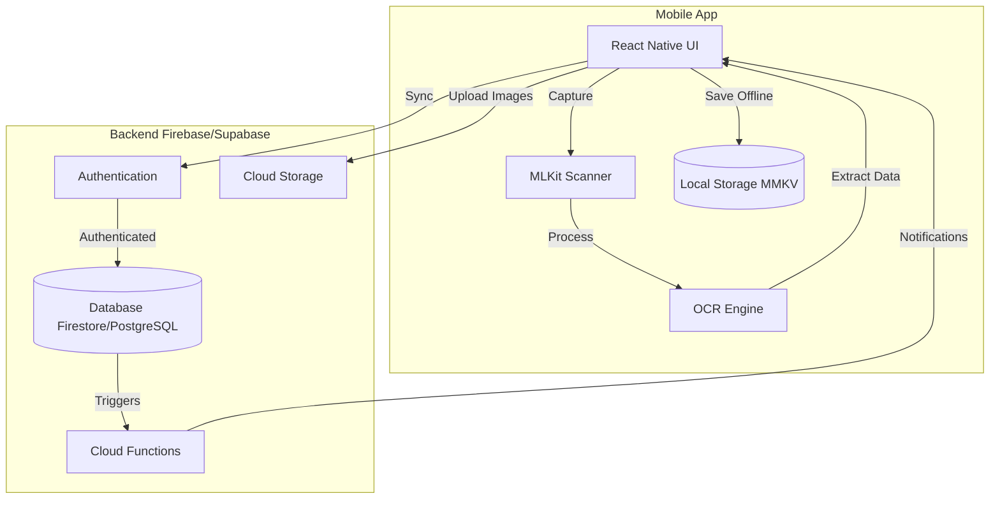

# ShoeBox Receipt Tracker - Zero to Completion

## App Overview

Receipt and expense tracking app with MLKit document scanning, OCR text extraction, cloud storage, user authentication, and smart categorization.

## Technology Stack Recommendation

**Backend:** Firebase (recommended) or Supabase

- Firebase: Firestore + Auth + Storage + Cloud Functions
- Supabase: PostgreSQL + Auth + Storage + Edge Functions

**Key Dependencies:**

- `@infinitered/react-native-mlkit-document-scanner` (already added)
- Firebase SDK or Supabase client
- React Query for data fetching
- Zustand or Jotai for state management
- React Native Vision Camera (if custom scanning needed)

## Phase 1: Foundation & Setup

### 1.1 Remove Boilerplate

- Delete demo screens: `DemoCommunityScreen`, `DemoDebugScreen`, `DemoPodcastListScreen`, `DemoShowroomScreen`
- Clean up navigation in [`app/navigators/AppNavigator.tsx`](app/navigators/AppNavigator.tsx)
- Remove unused i18n demo translations
- Keep: `WelcomeScreen`, `LoginScreen`, `ErrorScreen`, core components

### 1.2 Backend Setup

Choose and configure either:

- **Option A - Firebase:** Create project, add `@react-native-firebase/app`, configure Auth, Firestore, Storage
- **Option B - Supabase:** Create project, add `@supabase/supabase-js`, configure tables and storage buckets

### 1.3 Environment Configuration

- Create `.env` file for API keys/endpoints
- Add `expo-secure-store` for token storage
- Configure environment variables in `app.config.ts`

## Phase 2: Authentication & User Management

### 2.1 Auth Implementation

- Implement sign up/login in [`app/screens/LoginScreen.tsx`](app/screens/LoginScreen.tsx)
- Add email/password authentication
- Optional: Add Google/Apple Sign-In
- Implement secure token storage with MMKV or SecureStore
- Add biometric authentication (Face ID/Touch ID)

### 2.2 User Profile & Settings

- Create `ProfileScreen.tsx` for user settings
- Add profile management (name, email, photo)
- Settings: notifications, default currency, date format
- Account deletion flow

## Phase 3: Core Receipt Features

### 3.1 Document Scanning

- Create `ScanReceiptScreen.tsx` using MLKit document scanner
- Implement camera permission handling
- Add manual photo selection from gallery
- Image preprocessing (crop, rotate, enhance)

### 3.2 Receipt Data Model

Define schema (Firestore collections or Supabase tables):

```typescript
Receipt {
  id: string
  userId: string
  imageUrl: string
  thumbnailUrl: string
  merchantName: string
  amount: number
  currency: string
  category: string
  date: timestamp
  ocrText: string
  tags: string[]
  notes: string
  createdAt: timestamp
  updatedAt: timestamp
}
```

### 3.3 OCR Integration

- Integrate MLKit Text Recognition or Google Cloud Vision API
- Extract: merchant name, date, total amount, line items
- Parse receipt data with regex patterns
- Fallback to manual entry if OCR fails

### 3.4 Receipt Storage

- Upload images to cloud storage (Firebase Storage/Supabase Storage)
- Generate thumbnails for list views
- Store receipt metadata in database
- Implement optimistic updates for better UX

## Phase 4: Receipt Management

### 4.1 Home/Dashboard Screen

- Create `HomeScreen.tsx` with recent receipts
- Show spending summary (today, week, month)
- Quick stats: total expenses, categories breakdown
- Quick action button for scanning

### 4.2 Receipt List Screen

- Create `ReceiptsListScreen.tsx` with infinite scroll
- Show thumbnails, merchant, amount, date
- Pull-to-refresh functionality
- Skeleton loading states

### 4.3 Receipt Detail Screen

- Create `ReceiptDetailScreen.tsx`
- Display full image with pinch-to-zoom
- Show extracted data (editable)
- Add notes and tags
- Delete receipt option

### 4.4 Receipt Creation/Edit

- Create `AddReceiptScreen.tsx` for manual entry
- Edit existing receipt data
- Form validation
- Category picker component

## Phase 5: Categories & Organization

### 5.1 Category System

- Pre-defined categories: Groceries, Dining, Transportation, Shopping, Bills, Healthcare, Entertainment, Other
- Create `CategoryPickerComponent.tsx`
- Category icons and colors
- Allow custom categories

### 5.2 Tags & Search

- Implement tag system for receipts
- Create `SearchScreen.tsx` with filters
- Filter by: date range, category, amount range, tags, merchant
- Search through OCR text

### 5.3 Sorting & Grouping

- Sort by: date, amount, merchant, category
- Group receipts by: day, week, month, category
- Saved filter presets

## Phase 6: Analytics & Reports

### 6.1 Spending Analytics

- Create `AnalyticsScreen.tsx`
- Charts: spending over time, category breakdown (pie/bar charts)
- Use `react-native-chart-kit` or Victory Native
- Monthly/yearly comparisons

### 6.2 Export & Reports

- Generate PDF reports
- Export to CSV/Excel
- Email reports
- Tax-ready expense summaries

## Phase 7: Cloud Sync & Offline Support

### 7.1 Offline-First Architecture

- Implement local database with WatermelonDB or SQLite
- Queue uploads when offline
- Sync strategy: local-first, background sync
- Conflict resolution

### 7.2 Cloud Sync

- Real-time sync with Firebase/Supabase
- Background upload queue
- Retry failed uploads
- Sync status indicators

## Phase 8: Notifications & Reminders

### 8.1 Push Notifications

- Add `expo-notifications`
- Set up Firebase Cloud Messaging or Supabase Edge Functions
- Receipt uploaded confirmation
- Weekly/monthly spending summaries

### 8.2 Reminders

- Create reminder system for recurring expenses
- Notification for budget limits
- Monthly report notifications

## Phase 9: Polish & UX

### 9.1 Animations

- Add React Native Reanimated transitions
- Smooth list animations
- Loading states and skeletons
- Pull-to-refresh animations

### 9.2 Accessibility

- Add screen reader support
- High contrast mode
- Font scaling
- Accessible form labels

### 9.3 Error Handling

- Network error handling
- Retry mechanisms
- User-friendly error messages
- Sentry or Bugsnag integration

## Phase 10: Testing & Quality

### 10.1 Unit Testing

- Test utility functions (OCR parsing, amount extraction)
- Test state management logic
- Test API services
- Target 70%+ coverage

### 10.2 Integration Testing

- Expand Maestro tests beyond login
- Test complete flows: scan → save → view → edit
- Test offline scenarios

### 10.3 Performance

- Optimize image sizes
- Lazy load images
- Pagination for long lists
- Memory leak detection

## Phase 11: Deployment

### 11.1 Pre-launch

- Update app icon and splash screen (remove demo assets)
- Write App Store/Play Store descriptions
- Prepare screenshots
- Privacy policy and terms of service

### 11.2 Beta Testing

- Internal testing with TestFlight/Google Play Internal Testing
- Collect feedback
- Fix critical bugs

### 11.3 Production Release

- Build production bundles
- Submit to App Store (iOS)
- Submit to Play Store (Android)
- Monitor crash reports

## Phase 12: Post-Launch

### 12.1 Monitoring

- Set up analytics (Firebase Analytics, Mixpanel)
- Monitor crash reports
- Track user engagement
- Performance monitoring

### 12.2 Iteration

- Collect user feedback
- Feature requests prioritization
- Bug fixes and updates
- A/B testing for key features

## Architecture Diagram



## Key Files to Create/Modify

**Screens:**

- `app/screens/HomeScreen.tsx`
- `app/screens/ScanReceiptScreen.tsx`
- `app/screens/ReceiptsListScreen.tsx`
- `app/screens/ReceiptDetailScreen.tsx`
- `app/screens/AddReceiptScreen.tsx`
- `app/screens/SearchScreen.tsx`
- `app/screens/AnalyticsScreen.tsx`
- `app/screens/ProfileScreen.tsx`

**Services:**

- `app/services/firebase/` or `app/services/supabase/`
- `app/services/ocr/ocrService.ts`
- `app/services/storage/storageService.ts`
- `app/services/sync/syncService.ts`

**Models:**

- `app/models/Receipt.ts`
- `app/models/Category.ts`
- `app/models/User.ts`

**State Management:**

- `app/store/receiptStore.ts`
- `app/store/authStore.ts`
- `app/store/syncStore.ts`

## Estimated Timeline by Phase

- **Phase 1-2:** 1-2 weeks (Foundation + Auth)
- **Phase 3-4:** 2-3 weeks (Core scanning + receipt management)
- **Phase 5-6:** 2 weeks (Categories + analytics)
- **Phase 7:** 2 weeks (Sync + offline)
- **Phase 8-9:** 1-2 weeks (Notifications + polish)
- **Phase 10-11:** 1-2 weeks (Testing + deployment)

**Total estimated: 10-14 weeks for MVP**